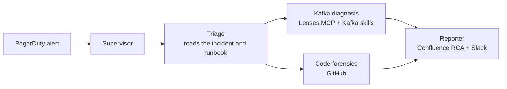

# Kafka SRE Agent

An AI incident responder for Apache Kafka. A PagerDuty alert fires; a team of
agents works out what broke on the cluster, finds the pull request that broke
it, and writes the root-cause analysis to Confluence and Slack.

Built with [Strands Agents](https://strandsagents.com),
[Lenses MCP](https://lenses.io) and Kafka skills from
[agentic-engineering-for-apache-kafka](https://github.com/lensesio/agentic-engineering-for-apache-kafka).
It runs entirely in Docker, against a real Kafka cluster with an incident
you can trigger on demand, and room to add your own.



1. **Triage** reads the incident and the runbook it links to, and pins down
   the cluster, consumer group, topic and service.
2. **Diagnosis** and **forensics** run in parallel: one investigates the
   cluster through Lenses MCP (lag, schemas, connectors, messages), the other
   searches the PRs merged in the org before the incident and reads their
   diffs.
3. The **supervisor** checks the suspect PR against what the cluster shows,
   ruling out the decoys merged the same morning.
4. The **reporter** publishes the RCA and posts a summary for the on-call
   channel.

## Quick start

You need Docker with Compose v2 (about 8 GB of memory for containers),
`make`, `curl`, Python 3 (standard library only) and an
[Anthropic API key](https://console.anthropic.com).

```sh
cp .env.sample .env       # then set ANTHROPIC_API_KEY
make up                   # first run builds images and seeds the cluster (a few minutes)
open http://localhost:8080
```

The cluster starts healthy. Break it, then let the agent find out why:

```sh
make induce               # registers an incompatible schema; the consumer stalls
```

In the dashboard, pick **PI7K3FQ** and press **Run**. Watch the agents work
in the activity feed; the RCA and the Slack message appear at the end. Then
restore the cluster:

```sh
make reset
```

`make help` lists every target, and `make ops` opens an
[operator console](docs/scenarios.md#the-operator-console) with the
cluster's live state and a button per step. Scenarios are folders under
[`harness/scenarios/`](harness/scenarios), and adding one needs no change to
the agent.

| Service | URL |
|---|---|
| Dashboard | http://localhost:8080 |
| Lenses HQ | http://localhost:9991 (`admin` / `admin`) |
| Phoenix (traces) | http://localhost:6006 |

Everything except Lenses runs against bundled fixtures by default:
PagerDuty, GitHub, Confluence and Slack are local stand-ins, so no other
accounts are needed. Each one can be
switched to the real service: see [Going live](docs/going-live.md).

## Documentation

- [How it works](docs/architecture.md): the agents, skills, MCP servers,
  model gateway, dashboard and tracing.
- [The incident](docs/scenarios.md): what breaks, what the alert knows, what
  the agent has to discover, and how to add a scenario.
- [Going live](docs/going-live.md): real PagerDuty, GitHub, Confluence and
  Slack.
- [The DSS26 Bank GitHub org](docs/github-org.md): the fictional bank the
  agent investigates, and how to seed your own copy.
- [Troubleshooting](docs/troubleshooting.md)

Links to the `dss26-org` GitHub org and the DSS26 Confluence space point at
private resources used for the live talk. You don't need them: the stand-ins
serve the same repositories and knowledge base offline.

## Repository layout

The repo has two halves: the agent, and the harness that runs, demos and
tests it. Nothing in `agent/` imports from `harness/`: in stub mode the agent
spawns the harness's MCP servers instead of the vendors', and otherwise
reaches it over the network like any Kafka estate.

```
agent/            THE AGENT: what you would deploy
  sub_agents/     the supervisor and its four specialists
  prompts/        one Markdown system prompt per agent
  skills/         Kafka skills the agents load on demand
  mcp_servers/    the agent's own Confluence and Slack MCP servers
  integrations/   vendor API clients, and the PagerDuty poller
  gateway/        model gateway config: alias -> provider model
ui/               the agent's dashboard (plus three unlisted presenter pages)
harness/          THE HARNESS: runs, demos and tests the agent
  stack/          Docker Compose: Kafka, Lenses, the fraud consumer, gateway, Phoenix
  scenarios/      the incidents, one folder each: alert, break, reset
  stubs/          offline PagerDuty, GitHub, Confluence and Slack MCP servers
  github_org/     the fictional bank's GitHub org, declared as code
  seed/           seeds the cluster, Lenses and Phoenix
  pagerduty/      pages a real PagerDuty account with a scenario's alert
  ops/            the operator console's server
tests/            unit tests (no stack needed)
docs/             the documentation above
```

## Development

```sh
make venv        # .venv with the agent and dev dependencies
make test        # Python tests
make lint        # ruff + the UI's eslint
```

To iterate on the agent or the UI without rebuilding images, run them on the
host against the containerised stack:

```sh
.venv/bin/python -m agent.server      # agent API on :8765 (stop the agent-server container first)
cd ui && pnpm install && pnpm dev     # dashboard on :5173
make run                              # or a single run in the terminal
```

Changing a prompt in `agent/prompts/` or a skill in `agent/skills/` needs no
code change; `make agent-up` rebuilds the agent container.

## License

[MIT](LICENSE)
