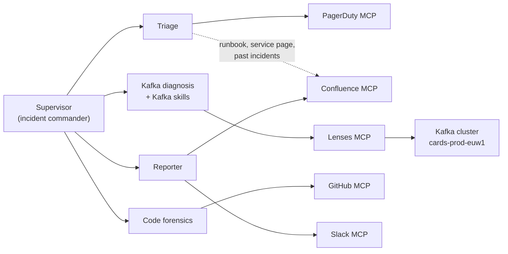

# How it works

## The agents

A [Strands](https://strandsagents.com) supervisor acts as incident commander.
It owns no external tools: its tools are four sub-agents, each wrapped as a
`@tool` and each holding one integration.

| Agent | Prompt | Job |
|---|---|---|
| Supervisor | [`supervisor.md`](../agent/prompts/supervisor.md) | Runs the order of work below and reconciles what the specialists found |
| Triage | [`triage.md`](../agent/prompts/triage.md) | Reads the incident and the runbook it links to; returns the affected cluster, consumer group, topic and service |
| Kafka diagnosis | [`diagnosis.md`](../agent/prompts/diagnosis.md) | Investigates the cluster through Lenses MCP, guided by the Kafka skills |
| Code forensics | [`forensics.md`](../agent/prompts/forensics.md) | Finds the change that caused it: PRs merged in the org before the incident, then their diffs |
| Reporter | [`reporter.md`](../agent/prompts/reporter.md) | Writes the RCA to Confluence, posts a summary to Slack and (live PagerDuty) a note on the incident |

**Order of work.** Triage first. Then diagnosis and forensics **in the same
turn**, so Strands runs them concurrently: neither waits for the other, and
the supervisor checks forensics' suspect against what Lenses shows. Then one
optional follow-up, then the reporter. The reporter receives the supervisor's
short verdict plus every specialist's output verbatim (the "case file",
`compose_case_file` in [`supervisor.py`](../agent/sub_agents/supervisor.py)),
so nothing is lost to a summary of a summary.

**Guardrails.**

- Forensics has a hard cap on GitHub calls per investigation
  ([`tool_budget.py`](../agent/tool_budget.py), `FORENSICS_TOOL_BUDGET`,
  default 14). When the culprit isn't on GitHub, the model would otherwise
  keep searching.
- Live PagerDuty: a hook ([`pagerduty_guard.py`](../agent/pagerduty_guard.py))
  lets the agent acknowledge and add notes, and cancels every other write.
  Resolving the incident stays a human decision.
- Live GitHub runs the official server with `--read-only` and an 8-tool
  allowlist.
- Live Confluence and Slack start in dry run, and Slack posts are
  deduplicated (see [Going live](going-live.md)).

**Prompts** are Markdown files with a tiny template syntax
(`…`, `{{ VAR }}`, see
[`agent/prompts/__init__.py`](../agent/prompts/__init__.py)). The flags come
from the run: which MCP servers and skills are enabled, and whether PagerDuty
is live. So each prompt only describes tools the agent actually has.

## Kafka skills

[`agent/skills/`](../agent/skills) holds 9 skills: Markdown playbooks that
the diagnosis agent (and the reporter, for `kafka-incident-report`) loads on
demand through Strands' `AgentSkills` plugin. Only their names and
descriptions are in the prompt until one is activated.

- Seven come from
  [lensesio/agentic-engineering-for-apache-kafka](https://github.com/lensesio/agentic-engineering-for-apache-kafka)
  ([`skills-lock.json`](../skills-lock.json) records the versions):
  consumer lag, performance review, schema review, connector review, DLQ
  review, security audit, topic audit.
- Two were written for this demo: `kafka-incident-rca` (schema registry
  before throughput, two signals per root cause) and
  `kafka-incident-report`.

The dashboard's sidebar can switch skills off per run, which makes their
effect easy to see.

## MCP servers

Each integration runs in one of two modes, chosen per server with
`<NAME>_MODE`: `stub` (the default) or `live`.
[`agent/mcp_clients.py`](../agent/mcp_clients.py) picks the server at startup.

| Server | Live | Stub: the harness's test double |
|---|---|---|
| Lenses | always live: the Lenses MCP container, against the demo cluster | |
| PagerDuty | PagerDuty's hosted MCP server | [`pagerduty_mcp.py`](../harness/stubs/pagerduty_mcp.py) serves each scenario's alert |
| GitHub | GitHub's official `github-mcp-server` | [`github_mcp.py`](../harness/stubs/github_mcp.py) mirrors the official server's tools over a snapshot of the fictional org |
| Confluence | the agent's own server, [`agent/mcp_servers/confluence.py`](../agent/mcp_servers/confluence.py), on the Confluence Cloud REST API | [`confluence_mcp.py`](../harness/stubs/confluence_mcp.py): the same server over the team's knowledge base ([`_kb_pages.py`](../harness/stubs/_kb_pages.py)) |
| Slack | the agent's own server, [`agent/mcp_servers/slack.py`](../agent/mcp_servers/slack.py), on the Slack Web API | [`slack_mcp.py`](../harness/stubs/slack_mcp.py): the same server, logging instead of posting |

The agent never imports a test double: stub mode only changes which module
it spawns. For GitHub, Confluence and Slack, stub and live expose the same
tool names and return the same JSON shape, so prompts and UI renderers don't
branch on the mode. The Confluence and Slack stubs reuse the agent's own
servers with a fixture back-end, so the tool contract has one definition.
Live PagerDuty is the vendor's own server with its own tools
(`browse_incidents`, `manage_incidents`), so the triage and reporter prompts
have a section for each. A live back-end that fails returns a structured
error to the model rather than falling back to fixtures: a run that silently
serves canned data while claiming to be live is worse than one that says
"Slack is unreachable".

The stdio servers run as child processes of the agent server. Lenses MCP is
a separate container reached over Streamable HTTP. It authenticates with the
service account `make provision` creates; without one (a host run), it falls
back to an interactive OAuth login against Lenses HQ
([`lenses_oauth.py`](../agent/lenses_oauth.py)).

## Models

Every model call goes through a LiteLLM gateway (`llm-gateway` in compose):
one OpenAI-compatible endpoint, which maps aliases to provider models in
[`agent/gateway/litellm.yaml`](../agent/gateway/litellm.yaml). The agent only ever names an
alias, so switching a role to another model is a dropdown: in the
dashboard's Models panel or the operator console's Models card. Both show
and change one setting on the agent server (`GET`/`PATCH /models`), which
every run uses, including one a PagerDuty page starts. It lives in memory:
restarting the agent goes back to the `*_MODEL` defaults.

| Alias | Model |
|---|---|
| `claude` | Claude Sonnet 5.5, the default for every role |
| `claude-haiku-5-5` | Claude Haiku 5.5 |
| `claude-haiku` | Claude Haiku 4.5 |
| `mistral-medium` | Mistral Medium 3.5 |
| `mistral-large` | Mistral Large |
| `gpt` | GPT-4o |

The Claude aliases have prompt caching switched on at the gateway: each turn
of a sub-agent's loop re-reads the conversation so far from cache. Hits show
as `cacheReadTokens` in the run metrics.

## The dashboard

- **[`agent/server.py`](../agent/server.py)**: a FastAPI app on :8765. It
  builds the MCP clients once at startup and, per run, a supervisor from the
  run's skills and servers and the server's models. `POST /runs` starts a run as a
  background task, which stores every frame of `supervisor.stream_async()`
  (every sub-agent's events included, nested) in SQLite.
  `GET /runs/{id}/events` streams those frames as server-sent events,
  following a run while it executes and replaying it afterwards. A run
  never depends on a browser: reloading the page, switching views or
  losing the connection doesn't stop it (EventSource resumes from the last
  frame), and any dashboard that opens picks up a run in progress.
  `POST /runs/{id}/cancel` stops one.
- **[`ui/`](../ui)**: React + Vite + Tailwind + shadcn, served on :8080 by
  compose. It shows the live activity feed, with a renderer per interesting
  tool (diffs, connector states, Slack previews, knowledge-base hits…), run
  history and per-agent token and time metrics. See
  [`ui/README.md`](../ui/README.md).

Three unlisted pages exist for presenting. They are part of the harness,
built into the dashboard so they share its origin:

- `/#/pagerduty`: a full-screen PagerDuty-style alert, to open the story.
- `/#/architecture`: an animated diagram of the system, with a step-by-step
  walkthrough of the incident.
- `/#/ops`: the [operator console](scenarios.md#the-operator-console), with
  the cluster's live state, a button per scenario step and the model per
  agent.

## Tracing

Every agent turn, model call and tool call is exported over OTLP to
[Phoenix](https://phoenix.arize.com) (http://localhost:6006, project
`kafka-sre-agent`). [`agent/tracing.py`](../agent/tracing.py) adds four things
to Strands' own spans:

- The OpenInference processor, so Phoenix shows prompts, completions and
  tool arguments.
- The run and incident ids on every span, so a run is one trace you can
  filter by `run.id`.
- The model behind each gateway alias: a model call shows
  `claude-sonnet-5-5`, `claude-haiku-4-5` or `gpt-4o` and its vendor, read
  from [`litellm.yaml`](../agent/gateway/litellm.yaml), not `claude`.
- Cached tokens counted once. The gateway's input count already includes
  them, and the OpenInference processor would add them again.

`make phoenix-costs` (run by `make up`) registers pricing for the models
Phoenix doesn't price itself, so traces show cost. Phoenix prices spans when it ingests them, so traces recorded
before that keep a cost of zero.

Tool arguments and results land in the traces. That's fine for this
synthetic cluster; think twice before pointing the stack at real data.
